```{r, include = FALSE}
knitr::opts_chunk$set(
  collapse = TRUE,
  comment = "#>"
)

Biocpkg <- function (pkg){
    sprintf("[%s](http://bioconductor.org/packages/%s)", pkg, pkg)
}

CRANpkg <- function(pkg){
    cran <- "https://CRAN.R-project.org/package"
    fmt <- "[%s](%s=%s)"
    sprintf(fmt, pkg, cran, pkg)
}

hooks = knitr::knit_hooks$get()
hook_foldable = function(type) {
   force(type)
   function(x, options) {
     res = hooks[[type]](x, options)
     if (isFALSE(options[[paste0("fold.", type)]])) return(res)
     paste0(
       "<details><summary>", type, "</summary>\n\n",
       res,
       "\n\n</details>"
     )
   }
}
knitr::knit_hooks$set(
  output = hook_foldable("output"),
  plot = hook_foldable("plot")
)
```

## Load required packages

```{r setup}
suppressPackageStartupMessages({
    library(MicrobiotaProcess) # an R package for analysis, visualization and biomarker discovery of Microbiome.
    library(phyloseq) # Handling and analysis of high-throughput microbiome census data.
    library(ggplot2) # Create Elegant Data Visualisations Using the Grammar of Graphics.
    library(tidyverse) # Easily Install and Load the 'Tidyverse'.
    library(vegan) # Community Ecology Package.
    library(coin) # Conditional Inference Procedures in a Permutation Test Framework.
    library(reshape2) # Flexibly Reshape Data: A Reboot of the Reshape Package.
    library(ggnewscale) # Multiple Fill and Colour Scales in 'ggplot2'.
})
```

Here, we use the 43 pediatric IBD stool samples as example, obtained from the Integrative Human Microbiome Project Consortium (iHMP). 

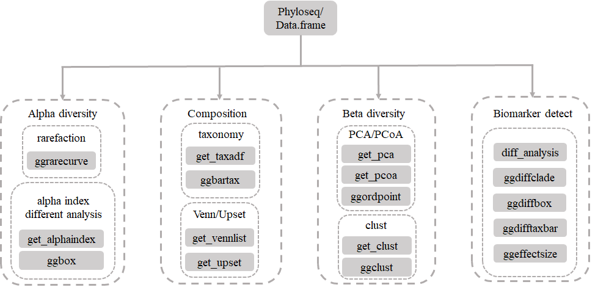

## Importing the output of dada2

The datasets were obtained from `https://www.microbiomeanalyst.ca/MicrobiomeAnalyst/resources/data/ibd_data.zip`. It contains `ibd_asv_table.txt`, which is feature table (*row features* X *column samples*), `ibd_meta.csv`, which is metadata file of samples, and `ibd_taxa.txt`, which is the taxonomic annotation of features. In the session, we use `import_dada2` of `MicrobiotaProcess` to import the datasets, and return a `phyloseq` object.

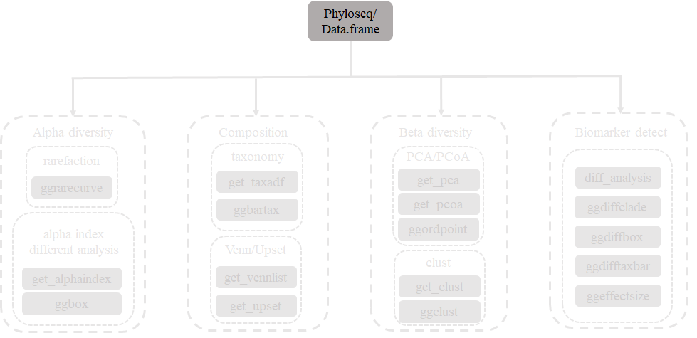

```{r, message=FALSE, warning=FALSE, fold.plot=FALSE, fold.output=FALSE, LoadData}
library(MicrobiotaProcess)
library(phyloseq)
otuda <- read.table("./IBD_data/ibd_asv_table.txt", header=T, 
                    check.names=F, comment.char="", row.names=1, sep="\t")
# building the output format of removeBimeraDenovo of dada2
otuda <- data.frame(t(otuda), check.names=F)
sampleda <- read.csv("./IBD_data/ibd_meta.csv", row.names=1, comment.char="")
taxda <- read.table("./IBD_data/ibd_taxa.txt", header=T, 
                    row.names=1, check.names=F, comment.char="")
# the feature names should be the same with rownames of taxda. 
taxda <- taxda[match(colnames(otuda), rownames(taxda)),]
psraw <- import_dada2(seqtab=otuda, taxatab=taxda, sampleda=sampleda)
# view the reads depth of samples. In this example, 
# we remove the sample contained less than 20914 otus.
# sort(rowSums(otu_table(psraw)))

# samples were removed, which the reads number is too little.
psraw <- prune_samples(sample_sums(psraw)>=sort(rowSums(otu_table(psraw)))[3], psraw)
# then the samples were rarefied to 20914 reads.
set.seed(1024)
ps <- rarefy_even_depth(psraw)
ps
```

### Other import

```{r, echo=FALSE, results='asis'}

x <- "MicrobiotaProcess\timport_qiime2\tImport function to load the output of qiime2\n
phyloseq\timport_biom\tImport phyloseq data from biom-format file\n
phyloseq\timport_qiime\tImport function to read the now legacy-format QIIME OTU table\n
phyloseq\timport_RDP_otu\tImport new RDP OTU-table format\n
phyloseq\timport_uparse\tImport UPARSE file format\n
phyloseq\timport_mothur\tGeneral function for importing mothur data files into phyloseq\n
base\tread.table or read.csv\timport table\n
"

xx <- strsplit(x, "\n\n")[[1]]
y <- strsplit(xx, "\t") %>% do.call("rbind", .)
y <- as.data.frame(y)
colnames(y) <- c("Package", "Import Function", "Description")

suppressPackageStartupMessages(require(kableExtra))
caption = "List of import function"
knitr::kable(y, caption=caption, booktabs = T) %>%
  collapse_rows(columns = 1, latex_hline = "major", valign ="middle") %>%
  kable_styling(latex_options = c("striped", "scale_down")) #%>% landscape
```

```{r class.source = 'fold-hide'}
# We also can use phyloseq to build phyloseq object.
library(phyloseq)
ps2 <- phyloseq(otu_table(otuda, taxa_are_rows=FALSE), sample_data(sampleda), tax_table(as.matrix(taxda)))
ps2
```

## alpha diversity analysis

### rarefaction visualization

Rarefaction, based on sampling technique, was used to compensate for the effect of sample size on the number of units observed in a sample. `MicrobiotaProcess` provided `ggrarecurve` to plot the curves, based on `rrarefy` of `vegan`

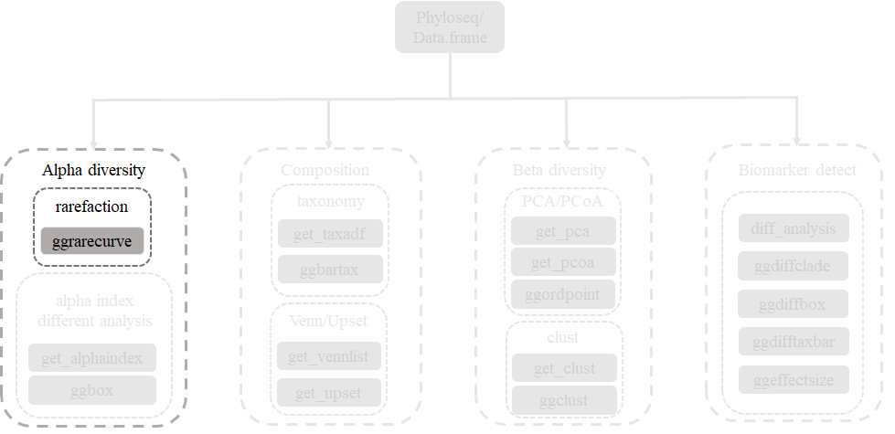

```{r class.source = 'fold-show', fold.output=FALSE, fold.plot=FALSE, fig.width=9.5, fig.height=6, warning=FALSE, message=FALSE, fig.cap="\\label{fig:Rarecurve}Example of rarefaction curve of samples", rarecurve}
library(MicrobiotaProcess)
library(patchwork)
# for reproducibly random number
set.seed(1024)
p_rare <- ggrarecurve(obj=ps,
                      indexNames=c("Observe","Chao1","ACE"),
                      chunks=400) +
          theme(legend.spacing.y=unit(0.01,"cm"),
                legend.text=element_text(size=4))
set.seed(1024)
prare1 <- ggrarecurve(obj=ps, factorNames="Group",
                      indexNames=c("Observe", "Chao1", "ACE"),
                      chunks=400, se=FALSE) +
          scale_fill_manual(values=c("#00AED7", "#FD9347"))+
          scale_color_manual(values=c("#00AED7", "#FD9347"))+
          theme_bw()+
          theme(axis.text=element_text(size=8), panel.grid=element_blank(),
                strip.background = element_rect(colour=NA,fill="grey"),
                strip.text.x = element_text(face="bold"))
p_rare / prare1
```

Since the curves in each sample were near saturation, the sequencing data were great enough with very few new species undetected

### Calculation and different analysis of alpha index

Alpha index can evaluate the richness and abundance of microbial communities. `MicrobiotaProcess` provides `get_alphaindex` to calculate alpha index. Six common diversity measures (*Observe*, *Chao1*, *ACE*, *Shannon*, *Simpson*, *J*) are supported. And the different groups of samples can be tested and visualize by `ggbox`.

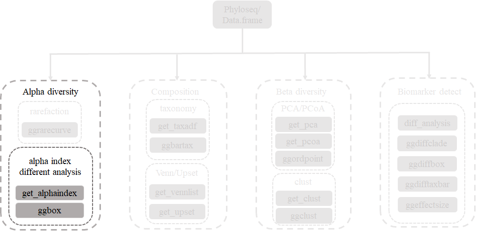

```{r class.source = 'fold-show', fold.output=FALSE, fold.plot=FALSE, fig.width=8, fig.height=3, warning=FALSE, message=FALSE, fig.cap="\\label{fig:Alphabox}Example of alpha box of samples", alphatest}
library(MicrobiotaProcess)
alphaobj <- get_alphaindex(ps)
head(as.data.frame(alphaobj))
p_alpha <- ggbox(alphaobj, geom="violin", factorNames="Group") +
           scale_fill_manual(values=c("#00AED7", "#FD9347"))+
	       theme(strip.background = element_rect(colour=NA, fill="grey"))
p_alpha
```

## Taxonomy composition analysis

### Statistics and visualization of specific levels

`MicrobiotaProcess` presents the `ggbartax` for the visualization of composition of microbial communities. If you want to get the abundance of specific levels of class, You can use `get_taxadf` then use `ggbartax` to visualize.

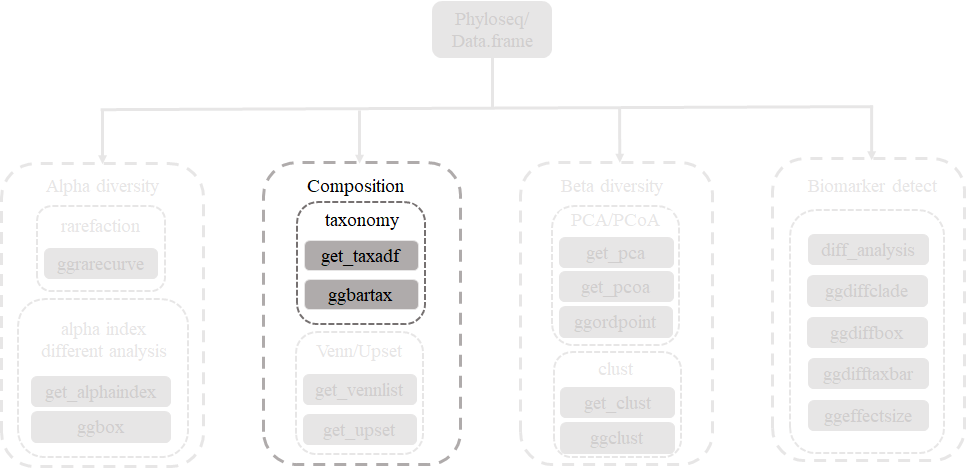

```{r class.source = 'fold-show', fold.output=FALSE, fold.plot=FALSE, fig.width=8.5, fig.height=4, warning=FALSE, message=FALSE, fig.cap="\\label{fig:Abundance1}Example of taxonomic abundance of samples", abundance}
library(ggplot2)
library(MicrobiotaProcess)

classtaxa <- get_taxadf(obj=ps, taxlevel=3)
# The 30 most abundant taxonomy will be visualized by default (parameter `topn=30`). 
pclass <- ggbartax(obj=classtaxa, facetNames="Group") +
          xlab(NULL) +
          ylab("relative abundance (%)") +
          scale_fill_manual(values=c(colorRampPalette(RColorBrewer::brewer.pal(12,"Set3"))(31))) +
          guides(fill= guide_legend(keywidth = 0.5, keyheight = 0.5))
pclass
```

```{r class.source="fold-hide", fig.width=4, fig.height=5, warning=FALSE, message=FALSE, fig.align="center"}
# Show the abundance in different groups.
fclass <- ggbartax(obj=classtaxa, facetNames="Group", plotgroup=TRUE, topn=10) +
          xlab(NULL) +
          ylab("relative abundance (%)") +
          scale_fill_manual(values=c(colorRampPalette(RColorBrewer::brewer.pal(12,"Set3"))(31))) +
          guides(fill= guide_legend(keywidth = 0.5, keyheight = 0.5, ncol=2))
fclass
```

If you want to view the count of taxonomy, you can set the `count` parameter of `ggbartax` to `TRUE`.

```{r class.source = 'fold-show', fold.output=FALSE, fold.plot=FALSE, fig.width=8.5, fig.height=4, warning=FALSE, message=FALSE, fig.cap="\\label{fig:Abundance2}Example of taxonomic abundance (Count) of samples", abundance2}
pclass2 <- ggbartax(obj=classtaxa, count=TRUE, facetNames="Group") +
          xlab(NULL) +
          ylab("count reads") +
          scale_fill_manual(values=c(colorRampPalette(RColorBrewer::brewer.pal(12,"Set3"))(31))) +
          guides(fill= guide_legend(keywidth = 0.5, keyheight = 0.5))
pclass2
```

### Venn or Upset plot

The Venn or UpSet plot can help us to obtain the difference between groups in overview. MicrobiotaProcess provides features to obtain the input of VennDiagram or UpSet package.

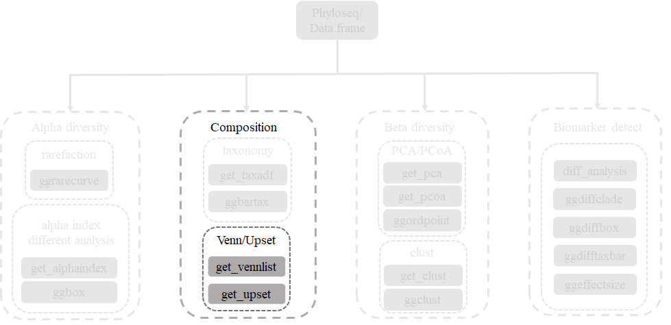

```{r, fold.output=FALSE, fold.plot=FALSE, fig.width=6, fig.height=6, fig.align="center", warning=FALSE, message=FALSE, fig.cap="\\label{fig:PCA}Example Venn or Upset plot", Venn}
vennlist <- get_vennlist(obj=ps, factorNames="Group")
upsetda <- get_upset(obj=ps, factorNames="Group")
library(VennDiagram)
library(UpSetR)
vennp <- venn.diagram(vennlist,
                      height=5,
                      width=5, 
                      filename=NULL, 
                      fill=c("#00AED7", "#FD9347"),
                      cat.col=c("#00AED7", "#FD9347"),
                      alpha = 0.85, 
                      fontfamily = "serif",
                      fontface = "bold",
                      cex = 1.2,
                      cat.cex = 1.6,
                      cat.default.pos = "outer",
                      cat.dist=0.1,
                      margin = 0.1, 
                      lwd = 3,
                      lty ='dotted',
                      imagetype = "svg")
grid::grid.draw(vennp)

upset(upsetda, sets=unique(as.vector(ps@sam_data$Group)), 
      sets.bar.color = "#56B4E9",
      order.by = "freq", 
      empty.intersections = "on")
```

## beta analysis

### PCA analysis

`PCA` (Principal component analysis) and `PCoA` (Principal Coordinate Analysis) are general statistical procedures to compare groups of samples. And `PCoA` can based on the phylogenetic or count-based distance metrics, such as `Bray-Curtis`, `Jaccard`, `Unweighted-UniFrac` and `weighted-UniFrac`. `MicrobiotaProcess` presents the `get_pca`, `get_pcoa` and `ggordpoint` for the analysis.

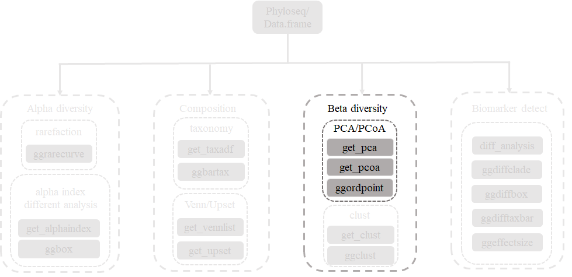

```{r class.source = 'fold-show', fold.output=FALSE, fold.plot=FALSE, fig.width=9, fig.height=3.6, warning=FALSE, message=FALSE, fig.cap="\\label{fig:PCA}Example of PCA of samples", PCAplot}
library(MicrobiotaProcess)
library(patchwork)
# If the input was normalized, the method parameter should be setted NULL.
pcares <- get_pca(obj=ps, method="hellinger")
# Visulizing the result
pcaplot1 <- ggordpoint(obj=pcares, biplot=TRUE, speciesannot=TRUE,
                      factorNames=c("Group"), ellipse=TRUE) +
            scale_color_manual(values=c("#00AED7", "#FD9347"))
# pc = c(1, 3) to show the first and third principal components.
pcaplot2 <- ggordpoint(obj=pcares, pc=c(1, 3), biplot=TRUE, speciesannot=TRUE,
                       factorNames=c("Group"), ellipse=TRUE) +
            scale_color_manual(values=c("#00AED7", "#FD9347"))
pcaplot1 | pcaplot2
```

### PCoA analysis


```{r class.source = 'fold-show', fold.output=FALSE, fold.plot=FALSE, fig.width=9, fig.height=3.6, warning=FALSE, message=FALSE, fig.cap="\\label{fig:PCoA}Example of PCoA of samples", PCoAplot}
# distmethod
# "unifrac",  "wunifrac", "manhattan", "euclidean", "canberra", "bray", "kulczynski" ...(vegdist, dist)
pcoares <- get_pcoa(obj=ps, distmethod="bray", method="hellinger")
# Visualizing the result
pcoaplot1 <- ggordpoint(obj=pcoares, biplot=TRUE, speciesannot=TRUE,
                       factorNames=c("Group"), ellipse=TRUE) +
            scale_color_manual(values=c("#00AED7", "#FD9347"))
# first and third principal co-ordinates
pcoaplot2 <- ggordpoint(obj=pcoares, pc=c(1, 3), biplot=TRUE, speciesannot=TRUE,
                        factorNames=c("Group"), ellipse=TRUE) +
             scale_color_manual(values=c("#00AED7", "#FD9347"))
pcoaplot1 | pcoaplot2
```

### Permutational Multivariate Analysis of Variance

We also can perform the Permutational Multivariate Analysis of Variance using the `vegan`

```{r class.source = 'fold-hide'} 
distme <- get_dist(ps, distmethod ="bray", method="hellinger")
sampleda <- data.frame(ps@sam_data, check.names=FALSE)
sampleda <- sampleda[match(colnames(as.matrix(distme)),rownames(sampleda)),,drop=FALSE]
sampleda$Group <- factor(sampleda$Group)
set.seed(1024)
adores <- adonis(distme ~ Group, data=sampleda, permutation=9999)
data.frame(adores$aov.tab)
```

### hierarchical cluster analysis of samples

`beta diversity` metrics can assess the differences between microbial communities. It can be visualized with `PCA` or `PCoA`, this can also be visualized with hierarchical clustering. `MicrobiotaProcess` implements the analysis based on `ggtree`.

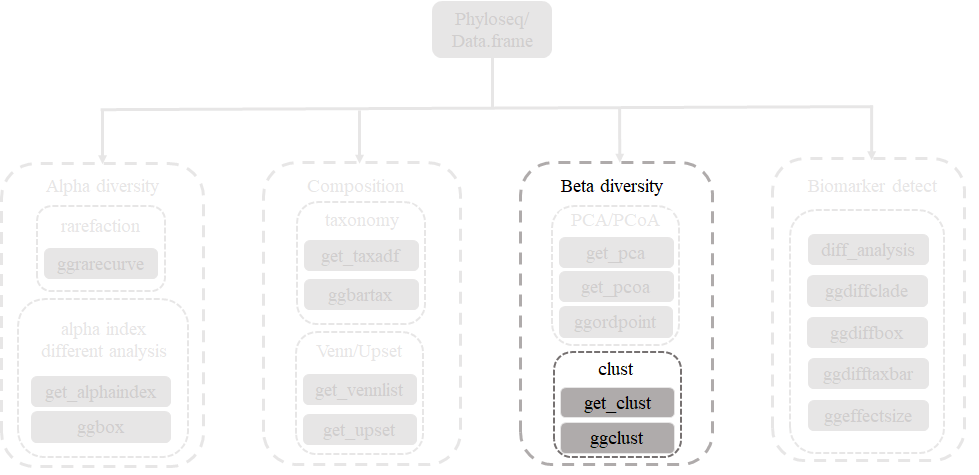

```{r class.source = 'fold-show', fold.output=FALSE, fold.plot=FALSE, fig.width=10, fig.height=4, warning=FALSE, message=FALSE, fig.cap="\\label{fig:HClust}Example of hierarchical clustering of samples", Clust}
library(ggplot2)
library(MicrobiotaProcess)
library(ggtree)
hcsample <- get_clust(obj=ps, distmethod="bray",
                      method="hellinger", hclustmethod="average")
# rectangular layout
cplot1 <- ggclust(obj=hcsample,
                  layout = "rectangular",
                  pointsize=1,
                  fontsize=0,
                  factorNames=c("Group")
              ) +
              scale_color_manual(values=c("#00AED7", "#FD9347")) +
	          theme_tree2(legend.position="right",
			  plot.title = element_text(face="bold", lineheight=25,hjust=0.5))
# circular layout
cplot2 <- ggclust(obj=hcsample,
                  layout = "circular",
	              pointsize=1,
	              fontsize=2,
	              factorNames=c("Group")
          ) +
          scale_color_manual(values=c("#00AED7", "#FD9347")) +
          theme(legend.position="right")
cplot1 | cplot2
```

## biomarker discovery

This package provides `diff_analysis` to detect the biomarker. And the results can be visualized by `ggdiffbox`, `ggdiffclade`, `ggeffectsize` and `ggdifftaxbar`

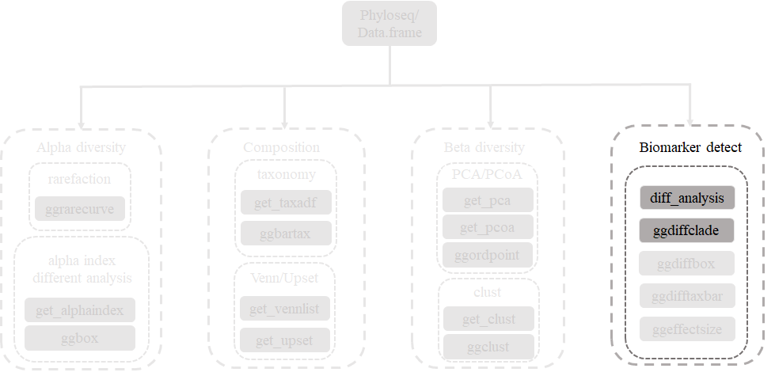

```{r class.source = 'fold-show', fold.output=FALSE, fold.plot=FALSE, warning=FALSE, message=FALSE, DErun}
# for the kruskal_test and wilcox_test
library(coin)
library(MicrobiotaProcess)
# Since the effect size was calculated by randomly re-sampling, 
# the seed should be set for reproducibly results.
set.seed(1024)
deres <- diff_analysis(obj = ps, classgroup = "Group",
                       mlfun = "lda",
                       filtermod = "pvalue",
                       firstcomfun = "kruskal_test",
                       firstalpha = 0.05,
                       strictmod = TRUE,
                       secondcomfun = "wilcox_test",
                       subclmin = 3,
                       subclwilc = TRUE,
                       secondalpha = 0.01,
                       lda=3)
deres
```

### visualization of different results by `ggdiffclade`

The color of discriminative taxa represent the taxa is more abundant in the corresponding group. The point size shows the negative logarithms (base 10) of pvalue. The bigger size of point shows more
significant (lower pvalue), the pvalue was calculated in the first step test.


```{r class.source = 'fold-show', fold.output=FALSE, fold.plot=FALSE, fig.width=6, fig.height=6, warning=FALSE, message=FALSE, fig.cap="\\label{fig:clade}Example of different biomarker clade", plotclade}
diffclade_p <- ggdiffclade(
                   obj=deres, 
                   alpha=0.3, 
                   linewd=0.15,
                   skpointsize=0.6, 
                   layout="radial",
                   taxlevel=3, 
                   removeUnkown=TRUE,
                   reduce=TRUE # This argument is to remove the branch of unknown taxonomy.
               ) +
               scale_fill_manual(
                   values=c("#00AED7", "#FD9347")
               ) +
               guides(color = guide_legend(
                                  keywidth = 0.1, 
                                  keyheight = 0.6,
                                  order = 3,
                                  ncol=1)
               ) +
               theme(
                   panel.background=element_rect(fill=NA),
                   legend.position="right", 
                   plot.margin=margin(0,0,0,0),
                   legend.spacing.y=unit(0.02, "cm"), 
                   legend.title=element_text(size=7),
                   legend.text=element_text(size=6), 
                   legend.box.spacing=unit(0.02,"cm")
               )
diffclade_p
```

### visualization of different results by `ggdiffbox`

The left panel represents the relative abundance or abundance (according the standard_method) of biomarker, the right panel represents the confident interval of effect size (LDA or MDA) of biomarker.
The bigger confident interval shows that the biomarker is more fluctuant, owing to the influence of samples number.

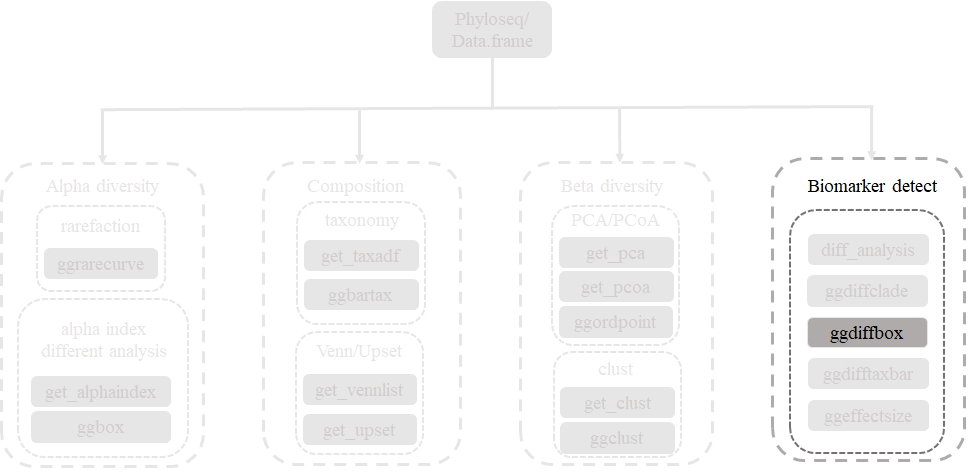

```{r class.source = 'fold-show', fold.output=FALSE, fold.plot=FALSE, fig.width=6, fig.height=4, warning=FALSE, message=FALSE, fig.cap="\\label{fig:diffboxplot}Example of biomarker boxplot and effect size", diffbox}
diffbox <- ggdiffbox(obj=deres, box_notch=FALSE, 
		     colorlist=c("#00AED7", "#FD9347"), l_xlabtext="relative abundance")
diffbox
```

### visualization of different results by `ggdifftaxbar`

`ggdifftaxbar` can visualize the abundance of biomarker in each samples of groups, the mean and median abundance of groups or subgroups are also showed. `output` parameter is the directory of output.

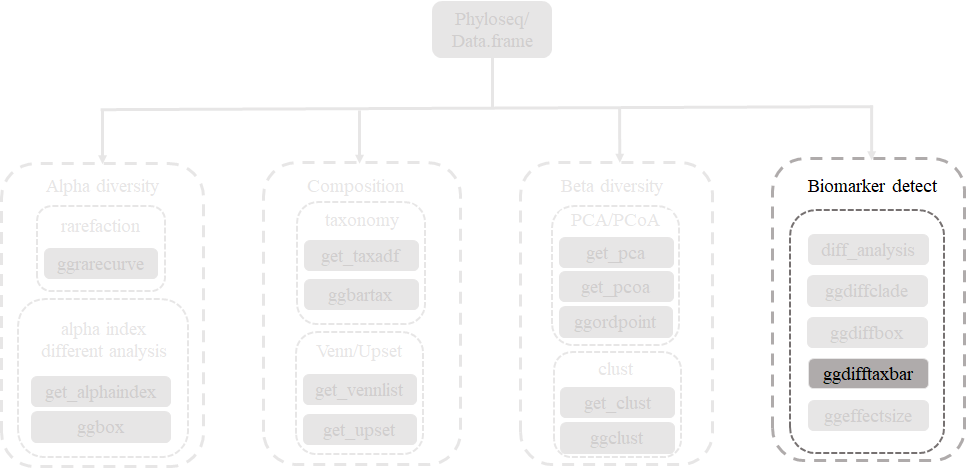

```{r class.source = 'fold-show'}
ggdifftaxbar(obj=deres, xtextsize=1.5, 
             output="IBD_biomarkder_barplot",
             coloslist=c("#00AED7", "#FD9347"))
```

### visualization of different results by `ggeffectsize`

The result is similar with the result of `ggdiffbox`, the bigger confident interval shows that the biomarker is more fluctuant owing to the influence of samples number.

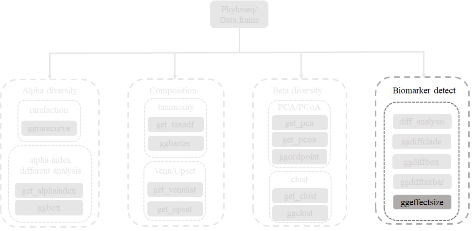

```{r class.source = 'fold-show', fold.output=FALSE, fold.plot=FALSE, fig.width=5, fig.height=5, warning=FALSE, message=FALSE, fig.cap="\\label{fig:ESplot}Example of effect size of biomarker", plotES}
es_p <- ggeffectsize(obj=deres, 
                     lineheight=0.1,
                     linewidth=0.3) + 
        scale_color_manual(values=c("#00AED7", 
                                    "#FD9347")) 

es_p
```

## Correlation of taxonomy

The result of different analysis also can be visualized with result of correlation.

```{r class.source = 'fold-hide', fig.width=6, fig.height=6, fig.align="center", warning=FALSE, message=FALSE, fig.cap="\\label{fig:clade}Example of different biomarker clade and correlation of genera", plotcorAnddiff}
genustab <- get_taxadf(ps, taxlevel=6)
genustab <- data.frame(t(genustab@otu_table), check.names=FALSE)
genustab <- data.frame(apply(genustab, 2, function(x)x/sum(x)), check.names=FALSE)

cortest <- WGCNA::corAndPvalue(genustab, method="spearman", alternative="two.sided")
cortest$cor[upper.tri(cortest$cor, diag = TRUE)] <- NA
cortest$p[upper.tri(cortest$p, diag = TRUE)] <- NA
cortab1 <- na.omit(melt(t(cortest$cor))) %>% rename(from=Var1,to=Var2,cor=value)
corptab1 <- na.omit(melt(t(cortest$p))) %>% rename(pvalue=value)
cortab1$fdr <- p.adjust(corptab1$pvalue, method="fdr")

cortab1 <- cortab1 %>% mutate(correlation=case_when(cor>0 ~ "positive",cor < 0 ~ "negative",TRUE ~ "No"))
cortab2 <- cortab1 %>% filter(fdr <= 0.05) %>% filter(cor <= -0.5 | cor >= 0.8)

p <- ggdiffclade(
         obj=deres,
         alpha=0.3,
         linewd=0.25,
         skpointsize=0.2,
         layout="inward_circular",
         taxlevel=7,
         cladetext=0,
         setColors=FALSE,
         xlim=16
     ) +
     scale_fill_manual(values=c("#00AED7", "#FD9347"),
                       guide=guide_legend(keywidth=0.5,
                                          keyheight=0.5,
                                          order=3,
                                          override.aes=list(alpha=1))
     ) +
     scale_size_continuous(range=c(1, 3),
                       guide=guide_legend(keywidth=0.5,keyheight=0.5,order=4,
                                          override.aes=list(shape=21))) +
     scale_colour_manual(values=rep("white", 100),guide="none")

p2 <- p +
      new_scale_color() +
      new_scale("size") +
      geom_tiplab(size=1, hjust=1) +
      geom_taxalink(
          data=cortab2,
          mapping=aes(taxa1=from,
                      taxa2=to,
                      colour=correlation,
                      size=abs(cor)),
          alpha=0.4,
          ncp=10,
          hratio=1,
          offset=1.2
      ) +
      scale_size_continuous(range = c(0.2, 1),
                            guide=guide_legend(keywidth=1, keyheight=0.5,
                                               order=1, override.aes=list(alpha=1))
      ) +
      scale_colour_manual(values=c("chocolate2", "#009E73"),
                          guide=guide_legend(keywidth=0.5, keyheight=0.5,
                          order=2, override.aes=list(alpha=1, size=1)))
p2
```

## Session information

Here is the output of `sessionInfo()` on the system on which this document was compiled:

```{r, echo=FALSE}
sessionInfo()
```

## Reference
